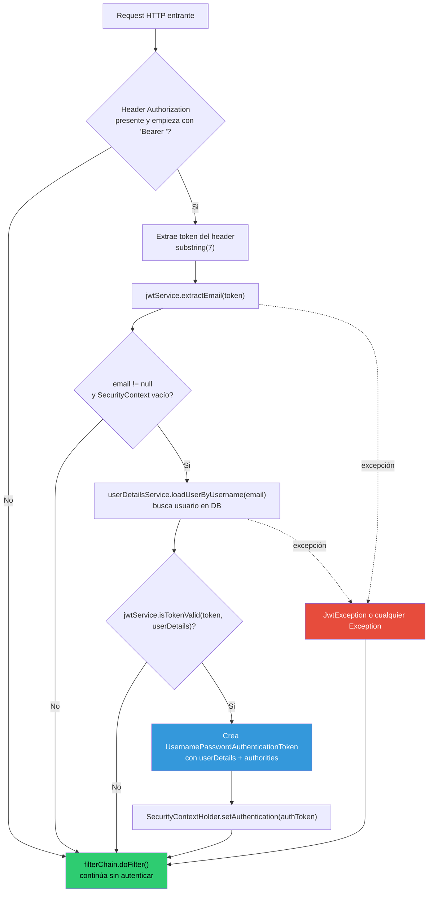
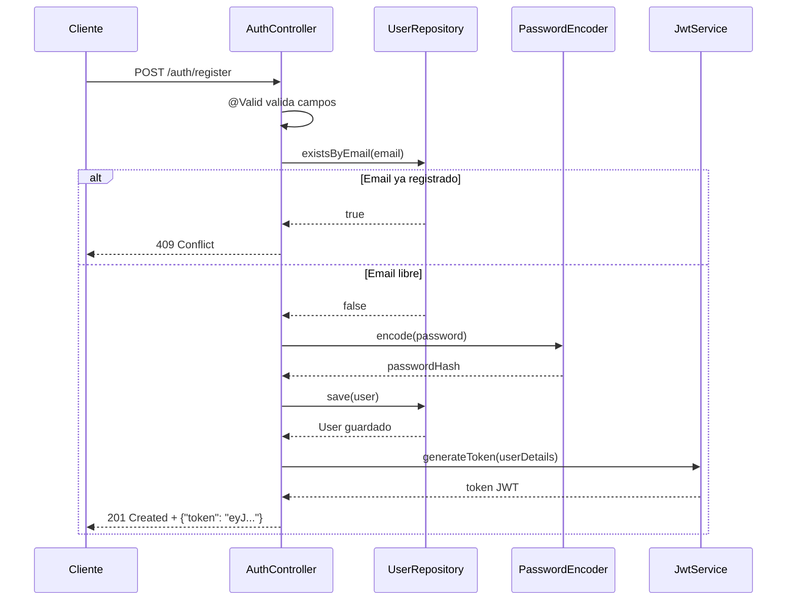
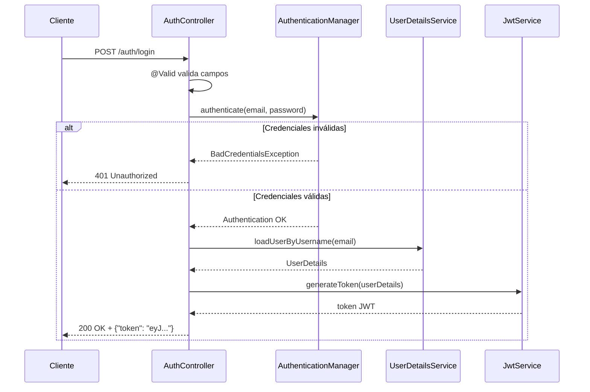

# Autenticación y Seguridad JWT

## Visión General

La autenticación es **stateless**: el servidor no guarda sesiones. Cada request lleva su propio token JWT en el header `Authorization`. El servidor verifica la firma del token en cada request sin consultar ningún store de sesiones.

### Flujo completo

```
POST /auth/register  →  crea usuario, devuelve token
POST /auth/login     →  verifica credenciales, devuelve token
GET  /users          →  requiere "Authorization: Bearer <token>"
POST /notifications  →  requiere token; el userId se extrae del token, no del body
```

El token es la única fuente de identidad del usuario durante el ciclo de vida de una request.

---

## 1. Dependencias

```groovy
// Spring Security
implementation 'org.springframework.boot:spring-boot-starter-security'

// JJWT 0.12.x
implementation 'io.jsonwebtoken:jjwt-api:0.12.6'
runtimeOnly 'io.jsonwebtoken:jjwt-impl:0.12.6'
runtimeOnly 'io.jsonwebtoken:jjwt-jackson:0.12.6'

// Tests de seguridad
testImplementation 'org.springframework.security:spring-security-test'
```

**JJWT 0.12.x** usa una API fluida distinta a versiones anteriores (`Jwts.builder()`, `Jwts.parser()`, `Keys.hmacShaKeyFor()`). La separación en `api` / `impl` / `jackson` permite declarar la implementación como `runtimeOnly` — el código de la aplicación solo depende de la API pública.

---

## 2. Entidad User y campos de seguridad

```java
@Entity
@Table(name = "users")
public class User {
    @Id
    @GeneratedValue(strategy = GenerationType.IDENTITY)
    private Long id;

    @NotBlank
    @Column(nullable = false)
    private String username;

    @NotBlank
    @Email
    @Column(nullable = false, unique = true)
    private String email;

    @Column(name = "password_hash", nullable = false)
    private String passwordHash;

    @Column
    private String phone;

    @Column(name = "device_token")
    private String deviceToken;

    @Column
    private LocalDateTime createdAt;

    @PrePersist
    public void onCreate() {
        createdAt = LocalDateTime.now();
    }
}
```

### Decisiones de diseño

- **`passwordHash` en lugar de `password`**: el nombre del campo refleja lo que almacena — un hash BCrypt, no la contraseña en texto plano. Hace explícito en el código que nunca se guarda la contraseña real.
- **`email` como identificador único**: el `email` es la clave de autenticación (`username` en términos de Spring Security). El campo `username` es un nombre de display.
- **`@PrePersist`**: `createdAt` se asigna automáticamente antes de cada `INSERT`. No se puede pasar desde afuera.
- **Sin campo `roles`**: la aplicación no implementa autorización por roles. Todos los usuarios autenticados tienen los mismos permisos.
- **Campos `phone` y `deviceToken` (nullable)**: agregados para que los senders SMS y Push puedan registrar el número de teléfono y validar el token de dispositivo respectivamente. Ambos son opcionales para mantener compatibilidad con usuarios existentes.

---

## 3. DTOs de Auth

### RegisterRequest

```java
public record RegisterRequest(
        @NotBlank @Size(max = 50) String username,
        @NotBlank @Email String email,
        @NotBlank @Size(min = 8) String password
) {}
```

Validaciones:
- `username`: no puede ser blank, máximo 50 caracteres.
- `email`: no puede ser blank, debe tener formato de email válido.
- `password`: no puede ser blank, mínimo 8 caracteres. Spring valida esto antes de que el controller ejecute — una contraseña de 7 caracteres devuelve 400 automáticamente.

### LoginRequest

```java
public record LoginRequest(
        @NotBlank @Email String email,
        @NotBlank String password
) {}
```

Validaciones mínimas: ambos campos no pueden ser blank y el email debe tener formato válido. La lógica de "credenciales incorrectas" la maneja `AuthenticationManager`, no la validación del DTO.

### AuthResponse

```java
public record AuthResponse(String token) {}
```

Response único para register y login. Contiene un solo campo: el token JWT. El cliente lo almacena y lo envía en `Authorization: Bearer <token>` en cada request subsiguiente.

---

## 4. Infraestructura JWT (JwtService)

### generateToken()

```java
public String generateToken(UserDetails userDetails) {
    return Jwts.builder()
            .subject(userDetails.getUsername())
            .issuedAt(new Date())
            .expiration(new Date(System.currentTimeMillis() + expirationMs))
            .signWith(getSigningKey())
            .compact();
}
```

- **Subject**: el email del usuario (lo que `UserDetails.getUsername()` devuelve en esta implementación).
- **Claims incluidos**: `sub` (email), `iat` (issued at), `exp` (expiration).
- **Algoritmo**: HMAC-SHA256 (`HS256`). `Keys.hmacShaKeyFor()` selecciona automáticamente el algoritmo según el tamaño de la clave.
- No se agregan claims custom adicionales (roles, etc.).

### extractEmail()

```java
public String extractEmail(String token) {
    return Jwts.parser()
            .verifyWith(getSigningKey())
            .build()
            .parseSignedClaims(token)
            .getPayload()
            .getSubject();
}
```

Parsea el token, verifica la firma con la clave secreta, y devuelve el `subject` (email). Si la firma es inválida, JJWT lanza una `JwtException`.

### isTokenValid()

```java
public boolean isTokenValid(String token, UserDetails userDetails) {
    try {
        final String email = extractEmail(token);
        return email.equals(userDetails.getUsername()) && !isTokenExpired(token);
    } catch (io.jsonwebtoken.JwtException e) {
        return false;
    }
}
```

Verifica dos condiciones:
1. El email del token coincide con el email del `UserDetails` cargado de la base de datos.
2. El token no está expirado.

Cualquier `JwtException` (firma inválida, token malformado) devuelve `false` en lugar de propagar la excepción.

### Configuración: variables de entorno

| Propiedad | Variable de entorno | Descripción |
|---|---|---|
| `jwt.secret` | `JWT_SECRET` | Clave secreta en Base64 para firmar tokens. Mínimo 32 bytes (256 bits) para HS256. |
| `jwt.expiration-ms` | `JWT_EXPIRATION_MS` | Duración del token en milisegundos. Default: `86400000` (24 horas). |

La clave se decodifica de Base64 en `getSigningKey()`:

```java
private SecretKey getSigningKey() {
    return Keys.hmacShaKeyFor(Decoders.BASE64.decode(secret));
}
```

En producción, `JWT_SECRET` debe ser una variable de entorno externa — nunca hardcodeada ni commiteada. En tests, se usa la clave fija del `application-test.yml`.

---

## 5. Filtro de Autenticación (JwtAuthFilter)

`JwtAuthFilter` extiende `OncePerRequestFilter`, lo que garantiza que se ejecuta exactamente una vez por request.

### Diagrama de flujo



### Casos de comportamiento

**Token válido**: el filtro extrae el email, carga el `UserDetails` de la base de datos, valida el token, y setea la autenticación en el `SecurityContextHolder`. Spring Security ve una request autenticada y permite el acceso al endpoint.

**Sin header Authorization** (o sin prefijo `Bearer `): el filtro llama a `filterChain.doFilter()` inmediatamente y retorna. El `SecurityContext` queda vacío. Si el endpoint requiere autenticación, Spring Security devuelve 401.

**Token inválido o expirado**: la excepción se captura silenciosamente en el bloque `catch (Exception e)`. El filtro llama a `filterChain.doFilter()` con el `SecurityContext` vacío. El resultado es 401, igual que si no hubiera token.

```java
try {
    // ... extrae email, carga user, valida token, setea contexto
} catch (Exception e) {
    // Invalid token — let the request continue unauthenticated
    // SecurityContext remains empty → Spring Security will return 401
}

filterChain.doFilter(request, response);
```

---

## 6. Configuración de Seguridad (SecurityConfig)

```java
http
    .csrf(AbstractHttpConfigurer::disable)
    .sessionManagement(session ->
            session.sessionCreationPolicy(SessionCreationPolicy.STATELESS))
    .authorizeHttpRequests(auth -> auth
            .requestMatchers("/auth/**", "/error").permitAll()
            .requestMatchers("/v3/api-docs/**", "/swagger-ui/**", "/swagger-ui.html").permitAll()
            .anyRequest().authenticated()
    )
    .exceptionHandling(ex -> ex.authenticationEntryPoint(
            (request, response, authException) -> {
                response.setStatus(HttpServletResponse.SC_UNAUTHORIZED);
                response.setContentType(MediaType.APPLICATION_JSON_VALUE);
                response.getWriter().write("{\"error\": \"Unauthorized\"}");
            }
    ))
    .addFilterBefore(jwtAuthFilter, UsernamePasswordAuthenticationFilter.class);
```

### Rutas públicas

| Patrón | Motivo |
|---|---|
| `/auth/**` | Register y login no requieren autenticación previa |
| `/error` | Endpoint interno de Spring para manejo de errores |
| `/v3/api-docs/**` | Swagger/OpenAPI spec |
| `/swagger-ui/**` | Swagger UI |
| `/swagger-ui.html` | Swagger UI |

Cualquier otra ruta requiere autenticación.

### Por qué CSRF está desactivado

CSRF (Cross-Site Request Forgery) protege aplicaciones que usan cookies de sesión. En una API stateless con JWT, no hay cookies de sesión — el token se envía en el header `Authorization`. Un atacante no puede enviar el header JWT desde otro dominio porque los browsers no lo hacen automáticamente (a diferencia de las cookies). CSRF no aporta protección en este modelo y agrega complejidad innecesaria.

### Por qué STATELESS SessionCreationPolicy

Con `SessionCreationPolicy.STATELESS`, Spring Security nunca crea ni usa una `HttpSession`. Esto garantiza que la autenticación no persiste entre requests y que la aplicación puede escalar horizontalmente sin necesidad de sticky sessions ni session replication.

### Orden del filtro

`addFilterBefore(jwtAuthFilter, UsernamePasswordAuthenticationFilter.class)` coloca el filtro JWT **antes** que el filtro estándar de autenticación por usuario y contraseña. Así, cuando llega una request con token válido, el `SecurityContext` ya está poblado antes de que los filtros posteriores de Spring Security procesen la request.

---

## 7. Endpoints de Auth

### POST /auth/register

**Request body**:
```json
{
  "username": "johndoe",
  "email": "john@example.com",
  "password": "mysecret123"
}
```

**Respuestas posibles**:

| Status | Condición |
|---|---|
| 201 Created | Registro exitoso. Body: `{"token": "eyJ..."}` |
| 400 Bad Request | Validación fallida (`@NotBlank`, `@Email`, `@Size`) |
| 409 Conflict | Email ya registrado |



### POST /auth/login

**Request body**:
```json
{
  "email": "john@example.com",
  "password": "mysecret123"
}
```

**Respuestas posibles**:

| Status | Condición |
|---|---|
| 200 OK | Login exitoso. Body: `{"token": "eyJ..."}` |
| 400 Bad Request | Validación fallida (`@NotBlank`, `@Email`) |
| 401 Unauthorized | Credenciales incorrectas o email desconocido |



---

## 8. Integración con Notificaciones

### Extracción del usuario del SecurityContext

`NotificationService` no recibe el `userId` como parámetro. Lo obtiene del `SecurityContextHolder`:

```java
public EnrichedNotificationResponse createNotification(NotificationRequest request) {
    String email = SecurityContextHolder.getContext().getAuthentication().getName();
    User user = userRepository.findByEmail(email)
            .orElseThrow(() -> new ResponseStatusException(HttpStatus.UNAUTHORIZED, "Authenticated user not found"));

    Notification notification = new Notification();
    notification.setUser(user);
    // ...
}
```

El `JwtAuthFilter` setea la autenticación en el `SecurityContext` antes de que el request llegue al controller. El nombre del principal es el email (el `subject` del token). El service lo extrae con `.getAuthentication().getName()`.

### Por qué el userId no va en el NotificationRequest

El `NotificationRequest` no incluye un campo `userId`. Esto previene que un usuario autenticado cree notificaciones a nombre de otro usuario pasando un `userId` diferente en el body. El usuario siempre es el autenticado en el token.

### Ownership check en getNotificationsByUserId

```java
public List<EnrichedNotificationResponse> getNotificationsByUserId(Long userId) {
    User requestedUser = userRepository.findById(userId)
            .orElseThrow(() -> new ResponseStatusException(HttpStatus.NOT_FOUND, "User not found"));

    String authenticatedEmail = SecurityContextHolder.getContext().getAuthentication().getName();
    if (!requestedUser.getEmail().equals(authenticatedEmail)) {
        throw new ResponseStatusException(HttpStatus.FORBIDDEN, "Access denied");
    }

    return notificationRepository.findAllByUserId(userId)
            .stream()
            .map(this::enrichNotification)
            .toList();
}
```

`GET /notifications/user/{userId}` verifica que el `userId` de la URL corresponde al usuario autenticado en el token. Si el usuario A (token de A) intenta acceder a las notificaciones del usuario B (`/notifications/user/{idB}`), el service compara los emails y lanza 403.

---

## 9. Cobertura de Tests

### Tabla resumen

| Clase de test | Tipo | Escenarios cubiertos |
|---|---|---|
| `JwtServiceUnitTest` | Unitario | Generación de token válido, extracción de email, validación exitosa, token de otro usuario (false), token expirado (false), token tampered (excepción) |
| `AuthControllerIntegrationTest` | Integración | Register 201, register 409 (email duplicado), register 400 (campos inválidos), register 400 (password corta), login 200, login 401 (password incorrecta), login 401 (email desconocido), login 400 (campos vacíos) |
| `NotificationControllerIntegrationTest` | Integración | Create notification 201 (autenticado), create 401 (sin token), get notifications 401 (sin token), get own notifications 200, get other user notifications 403 |
| `UserControllerIntegrationTest` | Integración | Get all users 200, get user by id 200, get user 404, get users 401, get user by id 401, update user 200, update blank username 400, update invalid email 400, update not found 404, update 401, delete user 204, delete 401 |
| `UserRepositoryIntegrationTest` | Integración | Save y find, find by id, not found, delete |
| `UserServiceUnitTest` | Unitario | Find all, find by id, not found (excepción), update, delete |

### Escenarios de 401 y 403

Los tests de controller incluyen casos de acceso no autorizado en cada endpoint relevante:

- **401 sin token**: verifican que el `JwtAuthFilter` rechaza requests sin header `Authorization`.
- **401 con credenciales incorrectas**: `AuthControllerIntegrationTest` verifica que `AuthenticationManager` devuelve 401 ante password o email incorrectos.
- **403 cross-user**: `NotificationControllerIntegrationTest.shouldReturn403WhenAccessingAnotherUsersNotifications()` crea dos usuarios distintos y verifica que el usuario A no puede ver las notificaciones del usuario B.

### Por qué los tests usan el flujo real de JWT

Todos los tests de controller obtienen tokens reales via `registerAndLogin()` en lugar de mockear la autenticación con `@WithMockUser`. Esto garantiza que `JwtAuthFilter`, `JwtService`, y `SecurityConfig` se ejercitan en cada test, detectando regresiones en la cadena completa de seguridad.
