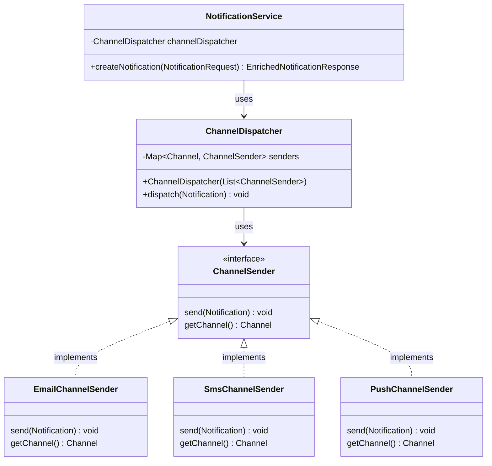
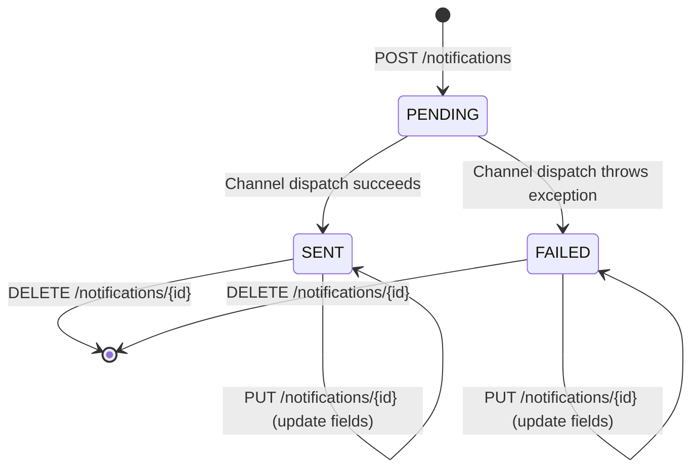
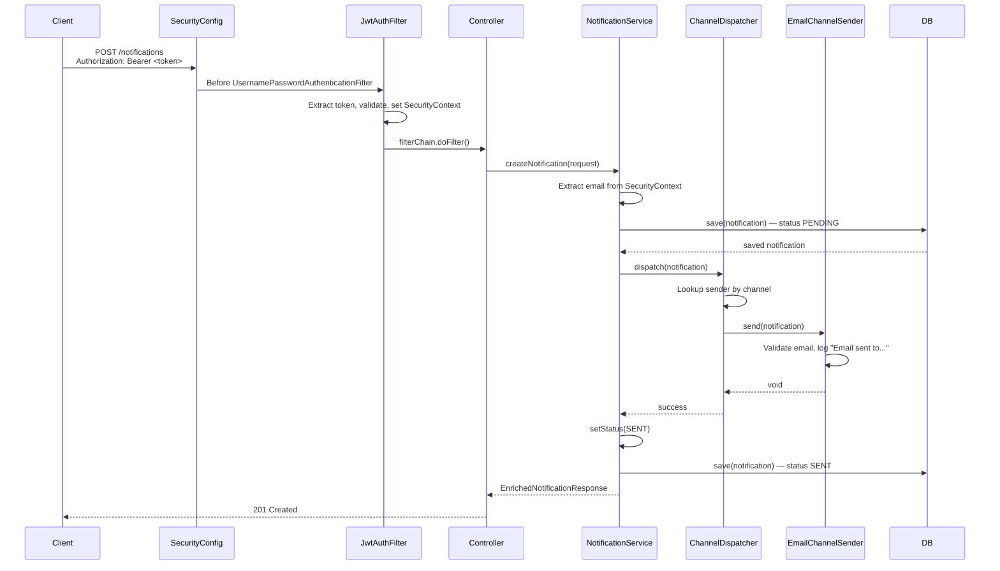

# Notification Channels & CRUD — Architecture Decisions

## Overview

This document covers the two major feature additions that complete the notification management system: **channel-specific simulated delivery** (Strategy Pattern) and **full CRUD with ownership enforcement**. Together with the JWT authentication layer (see `authentication.md`), these form the complete backend specified in the challenge instructions.

---

## 1. Channel Sending Architecture (Strategy Pattern)

### Intent

When a notification is created, channel-specific delivery logic must execute. The challenge requires three channels — Email, SMS, and Push Notification — each with its own validation, formatting, and logging. Critically, **adding a new channel must not require modifying existing code** (Open/Closed Principle).

### Design



### Why Strategy Pattern with Spring Auto-Discovery

| Alternative | Why Rejected |
|-------------|-------------|
| `if/else` or `switch` on channel type in NotificationService | Violates OCP — adding a channel requires modifying NotificationService |
| Factory with manual registration | More boilerplate, error-prone, less Spring-idiomatic |
| Event-driven with `ApplicationEvents` | Over-engineering for a simulation; harder to test end-to-end |

**Chosen approach**: Each channel is a `@Component` implementing `ChannelSender`. `ChannelDispatcher` receives `List<ChannelSender>` via constructor injection and builds a `Map<Channel, ChannelSender>` at construction time for O(1) lookup. Adding a new channel = new `@Component` class + new enum value. No existing code changes.

### Interface Contract

```java
public interface ChannelSender {
    void send(Notification notification);
    Channel getChannel();
}
```

`getChannel()` serves as the discriminator for the dispatcher's map. Spring auto-detects all `@Component` implementations and injects them as a `List<ChannelSender>`.

### Per-Channel Implementation

#### EmailChannelSender

Validates `user.getEmail()` is not null (defensive — `@NotBlank` on the entity already prevents this in practice). Logs the recipient email. The "template generation" is implicit — in a real implementation, this would render an HTML template.

```java
@Component
public class EmailChannelSender implements ChannelSender {
    private static final Logger log = LoggerFactory.getLogger(EmailChannelSender.class);

    @Override
    public void send(Notification notification) {
        String email = notification.getUser().getEmail();
        if (email == null) {
            throw new IllegalStateException("User email is null");
        }
        log.info("Email sent to {}", email);
    }

    @Override
    public Channel getChannel() {
        return Channel.EMAIL;
    }
}
```

#### SmsChannelSender

Truncates content to 160 characters (the SMS character limit). Logs the user's phone number, timestamp, and truncated content. Logs a warning if the user has no phone number set.

```java
@Component
public class SmsChannelSender implements ChannelSender {
    private static final Logger log = LoggerFactory.getLogger(SmsChannelSender.class);

    @Override
    public void send(Notification notification) {
        String content = notification.getContent();
        String truncated = content.substring(0, Math.min(content.length(), 160));
        String phone = notification.getUser().getPhone();
        if (phone != null) {
            log.info("SMS sent to {} at {}: {}", phone, Instant.now(), truncated);
        } else {
            log.warn("No phone number for user {}", notification.getUser().getId());
        }
    }

    @Override
    public Channel getChannel() {
        return Channel.SMS;
    }
}
```

#### PushChannelSender

Validates that the user has a non-null device token. Throws `IllegalStateException` if absent (causing the notification to get FAILED status). Formats a JSON payload with title and content and logs the dispatch with the device token.

```java
@Component
public class PushChannelSender implements ChannelSender {
    private static final Logger log = LoggerFactory.getLogger(PushChannelSender.class);

    @Override
    public void send(Notification notification) {
        String deviceToken = notification.getUser().getDeviceToken();
        if (deviceToken == null) {
            throw new IllegalStateException("No device token");
        }
        String payload = String.format(
            "{\"title\":\"%s\",\"content\":\"%s\"}",
            notification.getTitle(), notification.getContent()
        );
        log.info("Push notification dispatched to device {}: {}", deviceToken, payload);
    }

    @Override
    public Channel getChannel() {
        return Channel.PUSH;
    }
}
```

### Channel Dispatcher

```java
@Service
public class ChannelDispatcher {
    private final Map<Channel, ChannelSender> senders;

    public ChannelDispatcher(List<ChannelSender> senderList) {
        this.senders = senderList.stream()
                .collect(Collectors.toMap(ChannelSender::getChannel, Function.identity()));
    }

    public void dispatch(Notification notification) {
        ChannelSender sender = senders.get(notification.getChannel());
        if (sender == null) {
            throw new IllegalStateException("No sender registered for channel " + notification.getChannel());
        }
        sender.send(notification);
    }
}
```

Spring injects all `ChannelSender` beans into the `List<ChannelSender>` parameter automatically. The stream builds a map keyed by `Channel`. Adding a new sender implementation — Spring picks it up on the next startup.

### Integration into NotificationService

```java
public EnrichedNotificationResponse createNotification(NotificationRequest request) {
    // ... extract user from SecurityContext ...

    Notification notification = new Notification();
    // ... set fields ...

    Notification saved = notificationRepository.save(notification);  // status = PENDING

    try {
        channelDispatcher.dispatch(notification);
        notification.setStatus(Status.SENT);
    } catch (Exception e) {
        log.error("Failed to dispatch notification {}: {}", saved.getId(), e.getMessage());
        notification.setStatus(Status.FAILED);
    }
    notificationRepository.save(notification);

    return enrichNotification(notification);
}
```

The notification is first persisted with `PENDING` status (set via `@PrePersist`). The dispatcher runs synchronously. On success, status becomes `SENT`. On any exception, status becomes `FAILED`. The notification is saved again with the updated status.

---

## 2. How to Add a New Channel

The design satisfies the OCP requirement. Adding a new channel requires exactly two steps:

1. Add the new value to the `Channel` enum in `src/main/java/.../enums/Channel.java`
2. Create a new `@Component` class implementing `ChannelSender`

```java
@Component
public class WhatsAppChannelSender implements ChannelSender {
    private static final Logger log = LoggerFactory.getLogger(WhatsAppChannelSender.class);

    @Override
    public void send(Notification notification) {
        // Validate channel-specific requirements
        // Format payload
        log.info("WhatsApp message sent to user {}", notification.getUser().getId());
    }

    @Override
    public Channel getChannel() {
        return Channel.WHATSAPP;
    }
}
```

That's it. Spring auto-detects the new component on startup. The `ChannelDispatcher` picks it up without touching any other class.

---

## 3. Full CRUD with Ownership Enforcement

### Problem

The original notification API had three endpoints:

| Endpoint | Issue |
|----------|-------|
| `POST /notifications` | Fine |
| `GET /notifications/{id}` | **No ownership check** — any authenticated user could read any notification by ID |
| `GET /notifications/user/{userId}` | **Poor REST contract** — userId in URL path, vulnerable to IDOR |

Missing: update and delete.

### Solution

| Method | Path | Description |
|--------|------|-------------|
| POST | `/notifications` | Create notification (triggers channel dispatch) |
| GET | `/notifications` | List authenticated user's notifications |
| GET | `/notifications/{id}` | Get notification by ID (own only, 403 otherwise) |
| PUT | `/notifications/{id}` | Update title, content, attachmentIds |
| DELETE | `/notifications/{id}` | Delete notification (204 No Content) |

`GET /notifications/user/{userId}` was **removed**.

### Ownership Helper

```java
private Notification findOwnNotification(Long id) {
    String email = SecurityContextHolder.getContext().getAuthentication().getName();

    Notification notification = notificationRepository.findById(id)
            .orElseThrow(() -> new ResponseStatusException(HttpStatus.NOT_FOUND,
                    "Notification not found"));

    if (!notification.getUser().getEmail().equals(email)) {
        throw new ResponseStatusException(HttpStatus.FORBIDDEN, "Access denied");
    }

    return notification;
}
```

This single method provides consistent 404/403 behavior across `GET /{id}`, `PUT /{id}`, and `DELETE /{id}`. The auth email comes from the `SecurityContext` — no user ID is ever accepted from the URL or request body for resource access.

### Why Not `/notifications/user/{userId}`

| Approach | Problem |
|----------|---------|
| `/notifications/user/{userId}` (old) | Any authenticated user can pass any userId. The backend validates ownership (preventing data leaks), but exposing user IDs in URLs is a poor REST contract — it invites enumeration attacks. |
| `/notifications` (new) | The user identity comes from the JWT token, not the URL. No user ID is ever exposed or accepted. The endpoint is semantically correct: "give me MY notifications." |

### PUT /notifications/{id} — Immutable Channel

The update endpoint accepts `NotificationUpdateRequest`:

```java
public record NotificationUpdateRequest(
        @NotBlank String title,
        @NotBlank String content,
        List<Long> attachmentIds
) {}
```

**Channel is excluded.** Once a notification is created and dispatched through a channel, that channel cannot be changed. The Email delivery logic already ran — you cannot "un-send" and reroute through SMS.

### DELETE /notifications/{id} — Hard Delete

The delete uses JPA's `delete()` (hard delete). No soft-delete with `deletedAt` or `isDeleted` flag — the challenge instructions simply ask to "delete a notification." A 204 No Content response signals successful deletion.

---

## 4. Notification Lifecycle



Status transitions:
- **PENDING**: set by `@PrePersist` on creation, before dispatch
- **SENT**: set synchronously after successful channel dispatch
- **FAILED**: set when channel dispatch throws any exception

Note: PUT updates fields (title, content, attachmentIds) but does NOT change status and does NOT re-dispatch. A failed notification can be updated and re-created as a new POST if needed.

---

## 5. Request/Response Flow



---

## 6. Endpoint Error Matrix

| Scenario | Endpoint | Status | Body |
|----------|----------|--------|------|
| No token | Any /notifications/** | 401 | `{"error": "Unauthorized"}` |
| Notification not found | GET/PUT/DELETE /{id} | 404 | `{"status":404,"error":"Notification not found"}` |
| Owned by another user | GET/PUT/DELETE /{id} | 403 | `{"status":403,"error":"Access denied"}` |
| Blank title on create | POST /notifications | 400 | `{"status":400,"error":"Validation failed","errors":{"title":"..."}}` |
| Blank content on create | POST /notifications | 400 | `{"status":400,"error":"Validation failed","errors":{"content":"..."}}` |
| Invalid channel on create | POST /notifications | 400 | JSON parse error (Jackson deserialization) |
| Null channel on create | POST /notifications | 400 | `{"status":400,"error":"Validation failed","errors":{"channel":"..."}}` |
| Blank title on update | PUT /notifications/{id} | 400 | `{"status":400,"error":"Validation failed","errors":{"title":"..."}}` |
| Channel dispatch fails | POST /notifications | 201 (created) | Notification with status FAILED |
| Delete own notification | DELETE /notifications/{id} | 204 | Empty body |

The dispatch failure case is intentional: the notification WAS created. The client gets a 201 with status FAILED rather than a 500 that hides the created resource.

---

## 7. Test Coverage

### New Unit Tests (14)

| Test Class | Scenarios |
|------------|-----------|
| `EmailChannelSenderTest` | Null email → exception, valid email → logged |
| `SmsChannelSenderTest` | Within limit (no truncation), exceeds limit (truncated), exact 160 chars, phone present in log, null phone → warning |
| `PushChannelSenderTest` | JSON payload format verified, deviceToken present → dispatched, null deviceToken → exception |
| `ChannelDispatcherTest` | Correct sender dispatched, no sender for channel → exception |
| `NotificationServiceUnitTest` | findOwnNotification (found, 404, 403), getMyNotifications (with data, empty), updateNotification, deleteNotification |
| `UserTest` | Phone getter/setter, null phone by default, deviceToken getter/setter, null deviceToken by default |
| `RegisterRequestTest` | Optional phone and deviceToken accepted, both default to null |
| `UserResponseTest` | Phone and deviceToken included in response record |
| `UserBuilderTest` | withPhone() sets phone, withDeviceToken() sets device token |

### New Integration Tests (31)

| Scenario | Status |
|----------|--------|
| GET /notifications — authenticated, with data | 200 |
| GET /notifications — authenticated, empty list | 200 |
| GET /notifications — no token | 401 |
| GET /notifications/{id} — own notification | 200 |
| GET /notifications/{id} — other user's notification | 403 |
| POST /notifications — EMAIL channel | 201, status SENT |
| POST /notifications — SMS with >160 chars | 201, status SENT |
| POST /notifications — PUSH channel | 201, status SENT |
| POST /notifications — blank title | 400 |
| POST /notifications — blank content | 400 |
| POST /notifications — whitespace-only title | 400 |
| POST /notifications — invalid channel string | 400 |
| POST /notifications — null channel | 400 |
| PUT /notifications/{id} — update fields | 200, updated data |
| PUT /notifications/{id} — no token | 401 |
| PUT /notifications/{id} — other user's | 403 |
| PUT /notifications/{id} — not found | 404 |
| PUT /notifications/{id} — blank fields | 400 |
| DELETE /notifications/{id} — own | 204 |
| DELETE /notifications/{id} — no token | 401 |
| DELETE /notifications/{id} — other user's | 403 |
| DELETE /notifications/{id} — not found | 404 |

**Total**: 95 tests (69 baseline + 26 new), 0 failures.

---

## 8. Package Structure (Complete)

```
src/main/java/io/backend/notifications/
├── controller/
│   ├── AuthController.java              # POST /auth/register, POST /auth/login
│   ├── GlobalExceptionHandler.java      # @RestControllerAdvice
│   ├── NotificationController.java      # CRUD endpoints
│   └── UserController.java              # User management
├── service/
│   ├── NotificationService.java         # CRUD + dispatch integration
│   ├── UserService.java                 # User CRUD
│   └── channel/                         # ★ NEW — Strategy Pattern
│       ├── ChannelSender.java           # Interface
│       ├── ChannelDispatcher.java       # Auto-discovery dispatcher
│       ├── EmailChannelSender.java      # Email simulation
│       ├── SmsChannelSender.java        # SMS with 160-char truncation
│       └── PushChannelSender.java       # Push with JSON payload
├── security/
│   ├── JwtAuthFilter.java
│   ├── JwtService.java
│   ├── SecurityConfig.java
│   └── UserDetailsServiceImpl.java
├── entity/
│   ├── Notification.java
│   └── User.java
├── repository/
│   ├── NotificationRepository.java
│   └── UserRepository.java
├── dto/
│   ├── AuthResponse.java
│   ├── EnrichedNotificationResponse.java
│   ├── LoginRequest.java
│   ├── NotificationRequest.java         # @NotBlank title/content, Channel enum with @NotNull
│   ├── NotificationUpdateRequest.java   # ★ NEW — no channel field
│   ├── RegisterRequest.java
│   ├── UserRequest.java
│   └── UserResponse.java
├── enums/
│   ├── Channel.java                     # EMAIL, SMS, PUSH
│   └── Status.java                      # PENDING, SENT, FAILED
├── client/
│   └── ExternalMediaClient.java         # Photo enrichment
└── config/
    ├── OpenApiConfig.java
    └── RestClientConfig.java
```

---

## 9. Key Design Principles Applied

| Principle | How |
|-----------|-----|
| **Open/Closed** | ChannelSender interface — new channels add classes, don't modify existing ones |
| **Single Responsibility** | Each sender handles one channel; dispatcher handles routing; service handles persistence |
| **Dependency Inversion** | Service depends on ChannelDispatcher abstraction, not concrete senders |
| **Tell, Don't Ask** | `dispatcher.dispatch(notification)` — dispatcher decides which sender, service doesn't query |
| **Fail Fast** | `findOwnNotification` throws immediately on 404/403; dispatch throws on missing sender |
| **Least Privilege** | Ownership enforced on every ID-based endpoint; auth context as single source of identity |
