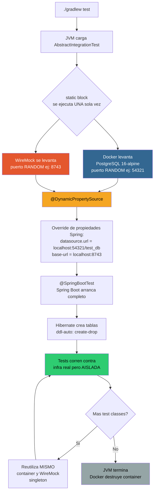
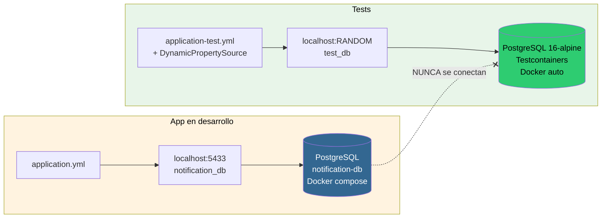
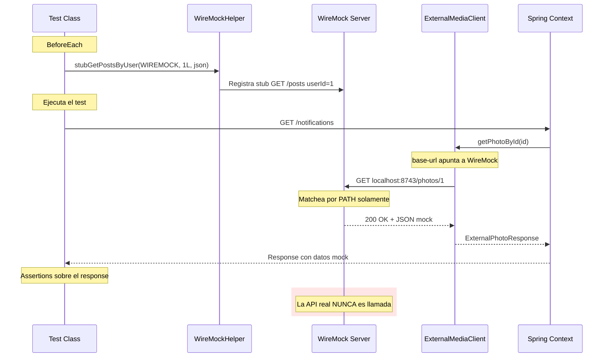
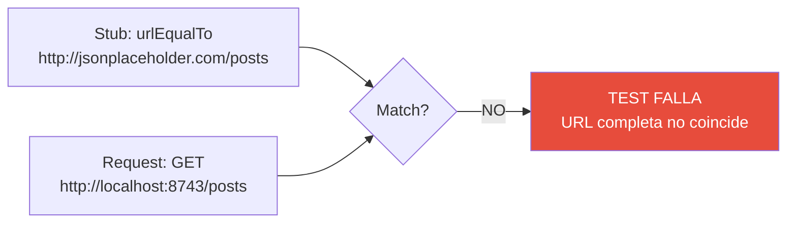
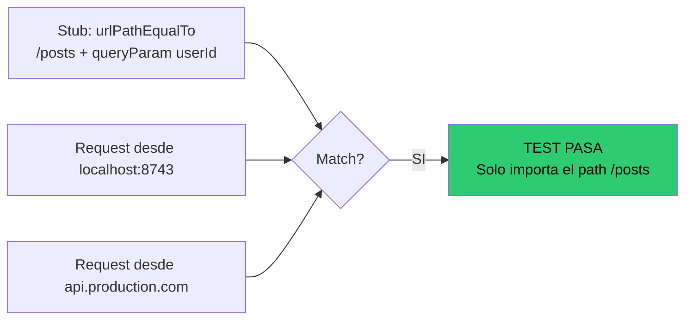
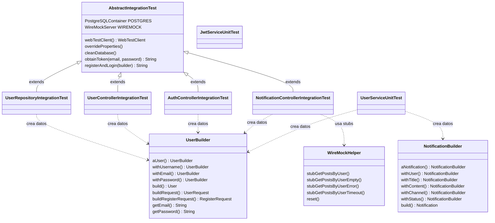
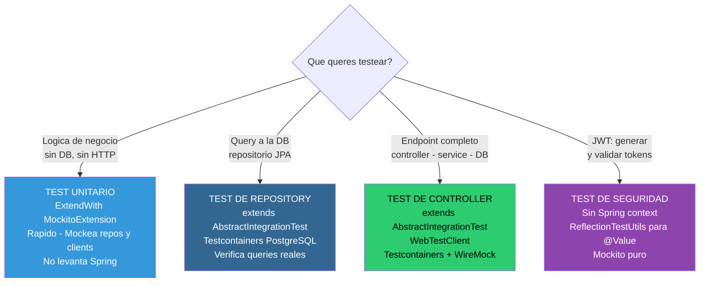

# Testing Architecture — Diagramas y Funcionamiento

---

## 1. Flujo de Ejecución de un Test de Integración

Paso a paso: qué pasa desde que corrés `./gradlew test` hasta que el test termina.



---

## 2. Aislamiento: Base de Datos de App vs Base de Test

Dos mundos completamente separados. Los tests NUNCA tocan la base de la app.



---

## 3. Flujo de Mocking con WireMock - URL Agnostic

Cómo el `ExternalMediaClient` pega a WireMock en vez de a la API real.



---

## 4. URL-Agnostic Matching

La clave de que los tests no se rompan si cambia la URL base.

### Forma INCORRECTA: urlEqualTo



### Forma CORRECTA: urlPathEqualTo



---

## 5. Arquitectura de Clases de Test

Cómo se relacionan las clases implementadas.



---

## 6. Estructura de Directorios

```
src/test/
├── java/io/backend/notifications/
│   │
│   ├── integration/                              Tests CON Spring context
│   │   ├── base/
│   │   │   └── AbstractIntegrationTest           Testcontainers + WireMock + WebTestClient
│   │   ├── controller/
│   │   │   ├── AuthControllerIntegrationTest     Tests de register y login
│   │   │   ├── UserControllerIntegrationTest     Tests de endpoints de usuarios
│   │   │   └── NotificationControllerIntegrationTest  Tests con auth JWT
│   │   └── repository/
│   │       └── UserRepositoryIntegrationTest     Tests de queries a DB
│   │
│   ├── unit/                                     Tests SIN Spring context
│   │   ├── security/
│   │   │   └── JwtServiceUnitTest                Tests de generacion y validacion de tokens
│   │   └── service/
│   │       └── UserServiceUnitTest               Tests con Mockito puro
│   │
│   └── fixture/                                  DATOS separados de LOGICA
│       ├── entity/
│       │   ├── UserBuilder                       Crea User + UserRequest + RegisterRequest
│       │   └── NotificationBuilder               Crea Notification
│       └── wiremock/
│           └── WireMockHelper                    Stubs reutilizables
│
└── resources/
    └── application-test.yml                      Profile "test"
```

---

## 7. Tipos de Test y Cuándo Usar Cada Uno



---

## 8. Resumen: Que Garantiza Esta Arquitectura

| Garantia | Como se logra |
|---|---|
| Tests nunca tocan la DB real | `@DynamicPropertySource` apunta a Testcontainers |
| Tests nunca llaman a la API externa | `base-url` apunta a WireMock |
| Cambiar la URL base no rompe tests | `urlPathEqualTo` matchea solo el path |
| Datos de test no se mezclan con logica | Builders en `fixture/`, tests en `integration/` y `unit/` |
| Tests son repetibles | Testcontainers crea DB limpia, WireMock se resetea en cada test |
| Tests son rapidos | Singleton: 1 container para TODOS los tests |
| Tests reflejan produccion | PostgreSQL real, misma imagen: 16-alpine |
| Tests de auth son independientes | `JwtServiceUnitTest` sin Spring context, `ReflectionTestUtils` para inyectar secreto |
